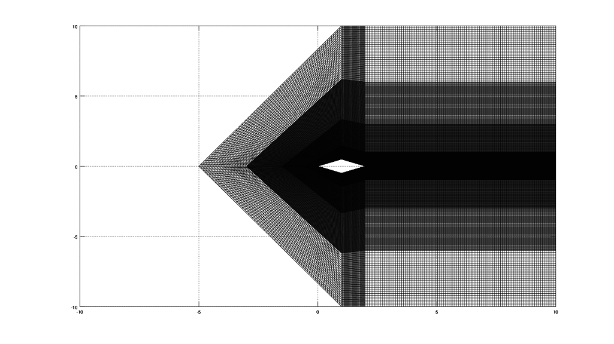
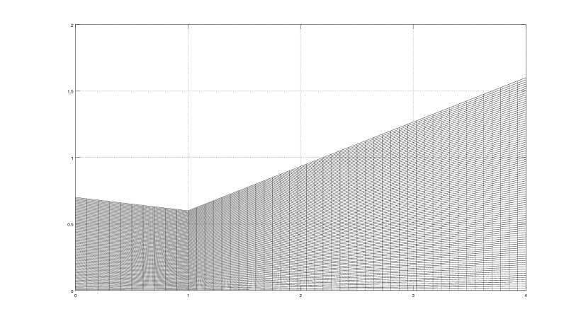
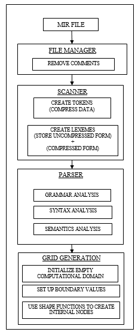

# SAMIR - System Agnostic Mesh Initializaiton Represantation
<i>SAMIR(Sanskrit for gust of wind or gentle breeze)</i> 
For underpriviliged students like me, a structured grid generation language and
 interpreter for Computational Fluid Dynamics. 
Yeah! You read me right. 
I created a high level language interpreter without taking any classes in
Compiler Design or even without being a CS major.  
Many people said,"It is stupid! You can't do it!". 
None of them understood the importance of the project... 
I justified,"Dude, the fact that you think I can't do it; shows your limits and not mine". 
Now, here we are.
This is my best work till now. 
#### Yeah! I am passionate about what I do. That's why I can do it far better than anyone else. 
Am I arrogant ? 
No,never. 
It is my "I told you so" moment and I plan to do so.
This is gonna change the world in the future. 
Just you wait, just you wait ... my name is...

## Author : Sayan Bhattacharjee
## Email  : aero.sayan@gmail.com

LICENSE : DEFAULT for now; will release in GPL v2 very soon.

### Why I created this?
Look, I am  poor and do not have the fancy CFD softwares or High Performance Computers(HPCs).
So, I gotta get it done on my trusted laptop. Like me there are many more people who are also
in same condition. This is for them. Also, from my personal perspective, I am gonna
do my Ph.D in distant future in hypersonic aerodynamics. So, I need this.

### How to use it?
Dude... sorry, for now. I have recently ported the most of the code to Python and
still there remains a lot of experimental features that are AMAZING!. But they
experimental and can be quite dangerous to use,if the user is not fully understanding the concept.
We users can be quite silly sometime.I need to silly proof it now. 
The best is yet to come :)

### Some experimental feature results
FIG : Supersonic aerofoil gird with local grid density clustering :* (It's so COOOL !)

FIG : Convergent Divergent Rocket Nozzle (It's beautiful! Kyaaa! XD )

### Technology used
+ Python for defining the SAMIR language standard and implementing it.
	- Python used for creating the tokenizer,lexer,parser,semantic analyis and boundary wall generation.
+ Cython to call high performance C++ code from Python.
+ C++ for the high performance stuff.
### SAMIR language processing scheme
The scheme and the process in which SAMIR is processed can be illustrated as follows. Right now, I want to advance it further, so I am focussing on developement rather than documentation. I will do so in future.

FIG : SAMIR scheme  

I promise to explain in detail later. But this is AWESOME !!!
